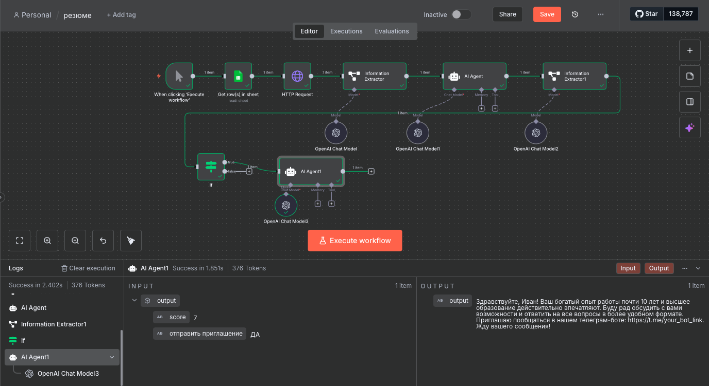

# Resume Scoring AI Workflow (n8n)

## Overview
This n8n workflow automates the evaluation of candidate resumes against job requirements using **OpenAI AI models** and **Google Sheets**. It scores candidates, provides structured feedback, and generates personalized invitation messages for promising applicants.

## Features
- Fetches candidate resumes from Google Sheets.
- Sends resumes through AI processing to extract structured information:
  - Name
  - Education
  - Work experience
- Compares candidate profiles against job requirements and generates a **score** (0–10).
- Provides a brief comment on strengths and gaps.
- Determines whether to invite the candidate for further communication.
- Sends a personalized, friendly invitation message to candidates via AI.

## Workflow Steps
1. **Manual Trigger** – Starts the workflow manually.
2. **Get row(s) in sheet** – Retrieves candidate data from a Google Sheet.
3. **HTTP Request** – Fetches resume content from a specified URL.
4. **Information Extractor** – Parses resumes into structured fields (name, education, work experience).
5. **OpenAI Chat Model** – Processes resume data for scoring and evaluation.
6. **AI Agent** – Compares candidate data against job requirements and outputs a JSON score with comments.
7. **Information Extractor1** – Extracts the final score and invitation decision from AI output.
8. **Conditional If** – Checks if the candidate should be invited.
9. **AI Agent1** – Generates a personalized invitation message for eligible candidates.

## Technology Stack
- [n8n](https://n8n.io/) – Workflow automation.
- [OpenAI](https://openai.com/) – AI-powered resume analysis and messaging.
- Google Sheets API – Stores candidate information and tracks workflow results.
- HTTP Requests – Fetch resume data from URLs.

## Usage
1. Clone this repository.
2. Import the workflow into your n8n instance.
3. Replace all credentials with your own for Google Sheets and OpenAI.
4. Click **Execute Workflow** to process resumes and generate scores and invitation messages.

---

> **Important:** All credentials and document IDs have been removed from this workflow. Replace placeholders with your own credentials before running.
